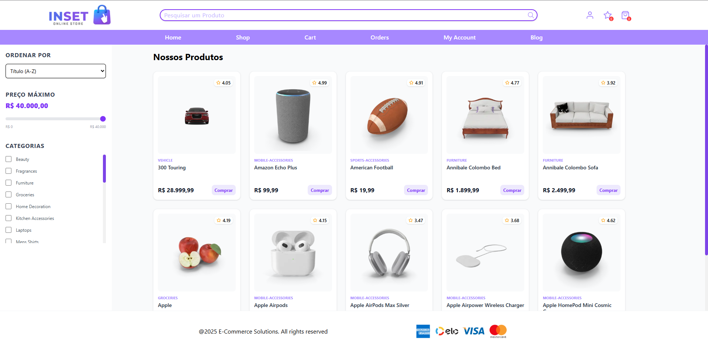
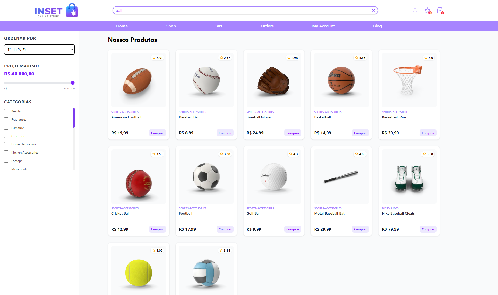
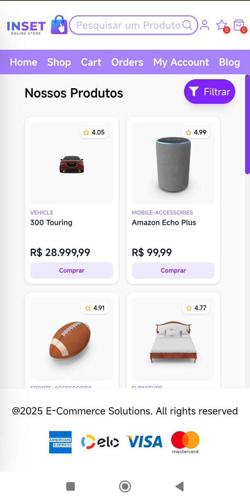
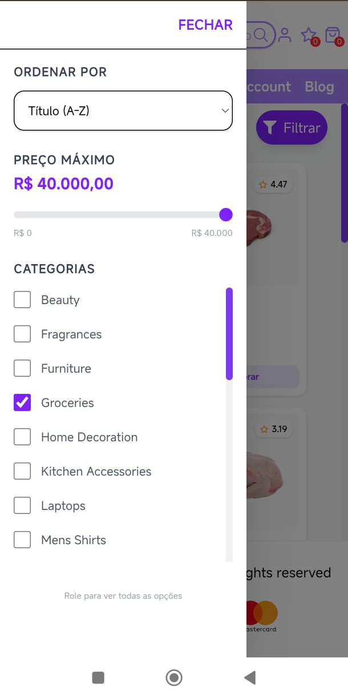
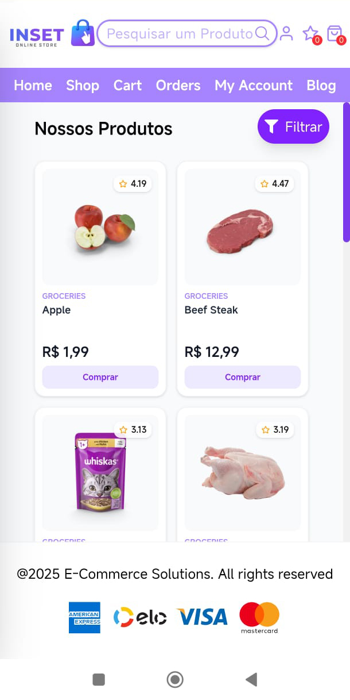

# Inset Store - E-Commerce

Plataforma de e-commerce, totalmente responsiva, desenvolvida utilizando Vite + React e Tailwind CSS para estilização. O projeto foca em uma experiência de usuário (UX) fluida, apresentando carregamento inteligente de dados e filtros dinâmicos.

Funcionalidades

- **Layout Dinâmico**: Estrutura com Header e Footer fixos, maximizando a área útil de navegação.
- **Responsividade Mobile-First**:
  - **Desktop**: Sidebar de filtros fixa e grid expandido.
  - **Mobile**: Menu de filtros em estilo *Drawer* (gaveta) e barra de busca otimizada para telas pequenas.
- **Pesquisa**:
  - SearchBar interativa, alterando vitrine conforme busca de produtos.
- **Sistema de Filtros**: 
  - Filtragem por múltiplas categorias simultâneas.
  - Controle de preço máximo via *range slider*.
  - Ordenação por preço, título e avaliação.
- **Infinite Scroll**: Carregamento automático de produtos conforme o usuário rola a página.


---

## 🛠️ Tecnologias Utilizadas

- **React.js**: Biblioteca principal para interfaces.
- **Tailwind CSS**: Estilização baseada em classes utilitárias.
- **Axios**: Consumo de API com gerenciamento centralizado.
- **Lucide React / React Icons**: Biblioteca de ícones.
- **Intersection Observer API**: Para implementação do Scroll Infinito nativo.

---

## 🎨 Guia de Estilo (Cores)

| Componente | Referência Tailwind | Hexadecimal | Amostra | Aplicação |
| :--- | :--- | :--- | :--- | :--- |
| **Primária** | `violet-600` | `#7C3AED` |  | Botões e Destaques |
| **Secundária** | `violet-400` | `#A78BFA` |  | Ícones e Links |
| **Background** | `gray-50` | `#F9FAFB` |  | Fundo das seções |
| **Botão close SearchBar** | `red-500` | `#EF4444` |  | Botão SearchBar |
| **Linhas/Bordas**| `gray-200` | `#E5E7EB` |  | Divisores e Bordas |

---

## 📂 Estrutura de Pastas Principal

```text
src/
 ├── components/       # Componentes globais (Header, Footer, Sidebar)
 ├── pages/            # Páginas da aplicação (Product/Home)
 ├── services/         # Configurações do Axios e chamadas de API
 ├── Layout/           # Wrapper de estrutura fixa da aplicação
 └── App.jsx           # Orquestração de estados globais e filtros

 ```

## Rodar Local

Para testar localmente, clone o repositório e utilize o comando

```bash
  npm install
```
Após instalar as dependencias, basta utilizar o comando

```bash
npm run dev
```

Ou se desejar ver o deploy, siga o link :
https://inset-store.vercel.app/

# 🖥️ Visualização Desktop
<p align="center">
  
  
</p>

# 📱 Visualização Mobile
<p align="center">
  
  
  
</p>
